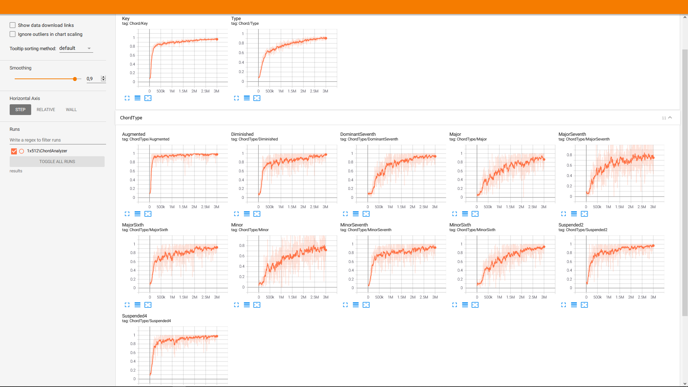

# Chord Detection with Unity ML-Agents
This is an attempt at detecting chords in continuous audio, using my [Audio Sensor](https://github.com/mbaske/ml-audio-sensor) for [Unity ML-Agents](https://github.com/Unity-Technologies/ml-agents).

The agent is trained to identify 11 different chord types and the correct key. Types, keys, chord inversions and transpositions are randomized. Training audio is generated on the fly with a couple of sample instruments, which is supposed to generalize the policy for various types of sounds. A bass note in the chord's key is added 50% of the time, as are random drum loops.
During training, the agent observes 0.48 second slices of audio, which is a compromise between training performance and reaction speed. Apparently, the agent has difficulties learning chord types with shorter observations. 

Here is the learning progress by chord type:

As you might expect, the agent has an easier time detecting the characteristics of augmented, diminished and suspended chords. Major and minor chord variants are a little harder to identify: is that particular frequency supposed to be an added 7th note, or just an overtone in the instrument's spectrum?

The visualization at inference shows the cumulative agent guesses as key colors, updated at 0.02 second intervals.
Generally, detection seems to work best for clean, unambiguous signals. The more complex the audio, the harder it gets for the agent to land on a particular chord. 

[Video](https://youtu.be/FuOo7v1pAlY)

